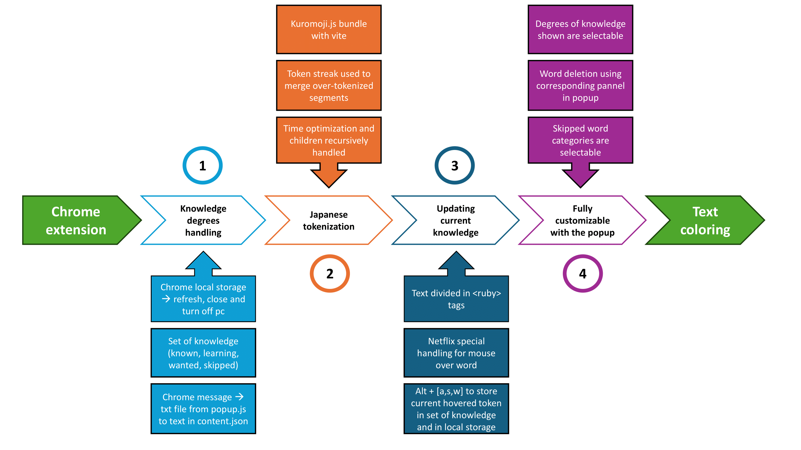

```
    _ (_)(_)(_) _                       (_)(_)(_)  _(_)_        
   (_)         (_)                         (_)   _(_) (_)_      
   (_)              _  _  _  _  _          (_) _(_)     (_)_    
   (_)             (_)(_)(_)(_)(_)         (_)(_) _  _  _ (_)   
   (_)          _                   _      (_)(_)(_)(_)(_)(_)   
   (_) _  _  _ (_)                 (_)  _  (_)(_)         (_)   
      (_)(_)(_)                     (_)(_)(_) (_)         (_)   
```

# Introduction

This project is, I hope, part of a broader series of very similar initiatives. The goal is to segment a text in a given language in order to identify the words we already know, the ones we're currently learning, the ones we want to learn, and those we don't know at all. This way, it's much easier at first glance to determine whether a text will be overwhelming or, on the contrary, too easy—depending, of course, on criteria like extensive or intensive reading. This particular project focuses on Japanese.
The objective is to integrate it directly into the browser so that, with just a few inputs from the user, they can easily use this extension across multiple platforms. The targets of this extension include both written content—like blog articles or online books—and subtitles from video platforms such as YouTube or Netflix.
We will discuss this in more depth, and for each language, part of the code will need to be adapted. Indeed, every language has its own way of being segmented, of returning to a word’s root or base form, and depending on the case, some elements of a language may be less important or not require deep learning. In Japanese, for instance, it's not necessary to learn particles in order to understand what you're reading. Therefore, each language should have its own list of categories that can be disregarded, as well as its own method of reconstructing a sentence.

# Usage

The use of this extension involves two main components.
The first is located in the extension's popup, found at the top of the browser. In this popup, the user can upload and manage various word lists corresponding to different levels of familiarity. It’s also within these same tabs that unwanted words can be deleted. The words are displayed in reverse chronological order, with the most recently added at the top. Users can directly load word lists from `.txt` files, where each word appears at the beginning of a line.
There are also settings that allow users to choose whether to display certain word lists, and to exclude specific word categories such as adverbs, interjections, or numbers.
The second usage involves keyboard shortcuts. By pressing `Alt` and then clicking on a piece of text, the text is segmented and color-coded. After that, hovering the mouse over a word presents several options:
- Pressing `Alt + !` allows the user to mark the exact word they are hovering over.
- Pressing `Alt + A` adds the word to the "known words" list.
- Pressing `Alt + W` adds the word to the "wanted words" list.
- Pressing `Alt + S` adds the word to the "skipped words" list.

# Developpement

To be able to develop this project, you need to have `Node.js version 22 or higher` installed. You also need to install kuromoji.js, a Japanese tokenizer for JavaScript, by running `npm i kuromoji`.
Once your modifications are made, you need to run `npm run build` to generate the `dist` folder, which will contain the unpackaged version of the extension.

## A - Quick overview



Using `Vite` and the extension `manifest`, we bundle all the JavaScript files in `src/content` into a single file called `content.js`. As a result, the extension only relies on two main files: `content.js` and `popup.js`.
This extension works in four main steps.
Text segmentation is handled in `tokenizer.js`. The main function receives a sentence in the form of a list of tokens. The sentence is segmented as finely as possible—perhaps even too finely—so part of the sentence needs to be reconstructed. Once the sentence is rebuilt with the desired level of granularity, each segment is wrapped inside a box (an HTML `<ruby> tag`), and several labels (as HTML `dataset` attributes) are attached to that box, making it independent from others. This way, if the knowledge or exclusion rules change, it’s enough to update that box’s styling—without needing to re-segment and reconstruct the entire text.
The word lists are stored in the extension's `local storage`. This storage has a limit of 5MB, which corresponds to roughly 300,000 words. This persistence allows users to refresh the page, close the browser, or even shut down their computer without losing their word lists.
The popup allows users to add words to lists, remove them, and adjust settings. Therefore, the popup.js file must be able to communicate with content.js. To achieve this, we use `chrome messages` to transmit the necessary information.

## B - What's next ?

Several features are planned for future development to enhance the extension’s functionality and usability. These include the ability to export word lists along with each word reading, and the addition of more configurable parameters in the settings. The popup will display the number of words in each category and allow users to search within a specific list. It will also support the registration of words along with their readings automatically—without requiring the user to input both kanji and hiragana (e.g., “kirei” or “ato” are often found in their hiragana form so by entering their kanji form, their hiragana form could also be registered).
Other planned features include being albe to merge closely related words (using `Alt + m` for instance) to help form idiomatic expressions. In the popup, be able to selecte multiple words at once for deletion, and a “delete all” button for entire lists. The extension will also better handle storage limits by capping the number of words to avoid exceeding the 5MB limit of local storage (about 300,000 five-character words).
Behavioral improvements are also planned: for example, preventing the skipping of words that already have an assigned color (i.e., words that are listed and should not be ignored), automatically attaching suffixes like “san”, “chan”, “kun” ([pos2 人名]) and “tachi” to the preceding name, and adding a counter for missing words—tracking how often each one appears as well as an evolution of its color (from dark red to bright red) thus indicating how often we encounter this unknown word.